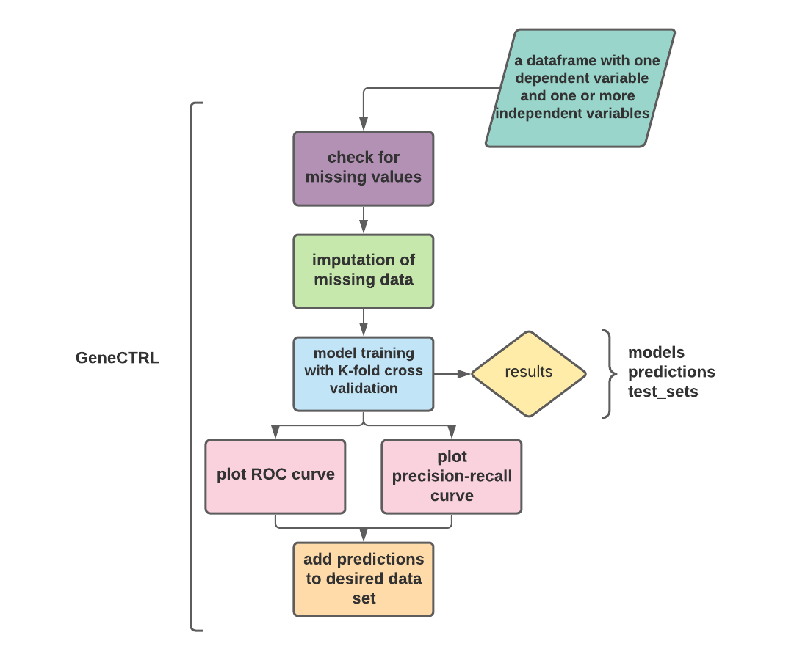

<!-- README.md is generated from README.Rmd. Please edit that file -->

# GeneCTLR

<!-- badges: start -->
<!-- badges: end -->

## Description

`GeneCTLR` (Gene Classification Tool with Logistic Regression) is an R
package designed to provide an easy and straightforward workflow for
building logistic regression models. When combined with gene-disease
association data, `GeneCTLR` can be used to predict causal genes and
identify potential predictor variables that may play a crucial role in
the disease etiology. Though similar R packages already exist for such
topic, they tend to be relatively hard to grasp for users who are new to
machine learning. `GeneCTLR`, on the other hand, provides a simple
workflow for beginner/intermediate R users who are new to logistic
regression but wish to apply it in their work.

## Installation

To install the latest version of the package:

``` r
require("devtools")
devtools::install_github("karahyx/GeneCTLR", build_vignettes = TRUE)
library("GeneCTLR")
```

## Overview

``` r
ls("package:GeneCTLR")
data(package = "GeneCTLR")
```

The logistic regression modeling workflow presented by `GeneCTLR`
contains five steps: checking for missing values, data imputation, model
training and K-fold cross validation, generating the ROC and
Precision-Recall curves, and adding model predictions to desired data
set. The five steps correspond to a total of 6 functions in `GeneCTLR`,
which contain the following:  
The **missingValues** function checks for the number of missing values
and unique values in each column, and provides a visual output for the
results.  
The **impute** function replaces the NA values in each variable with the
mean or the median of that variable.  
The **preProcessData** function pre-processes the data set based on user
input to be used in the **trainCV** function.  
The **trainCV** function trains the model and performs K-fold cross
validation.  
The **plotROC** function outputs a Receiver Operating Characteristic
curve (or ROC curve) based on the given class predictions and true class
labels.  
The **plotPR** function outputs a Precision-Recall curve (or PR curve)
based on the given class predictions and true class labels.  

The package also contains an RNA-binding protein data set rbps. Refer to
package vignettes for more details.

``` r
browseVignettes("GeneCTLR")
```

An overview of the package is illustrated below.



## Contributions

The author of the package is Kara Han.

The **missingValues** function makes use of the missmap function from
the `Amelia` R package to generate a visual output of the missing
values.

The **impute** function uses the median function from the `stats`
package to calculate the median of each column in the data set. The
algorithm was developed by the author, Kara Han.

The algorithm for **preProcessData** function was developed by the
author, Kara Han.

The **trainCV** function uses the `stats`, `caret`, and `dplyr` packages
to perform variable standardization and model training.

The **plotROC** function uses the auc function from the `pROC` R package
and the `ROCR` R package to calculate the area under the ROC curve (AUC)
values.  
The **plotPR** function uses the `ROCR` R package to calculate the area
under the precision-recall curve (AUCPR) values. Packages `ggplot2`,
`cowplot`, and `ggsci` were used to generate the ROC curves and PR
curves in **plotROC** and **plotPR**, respectively.

## References

Alice, M. (2020, July 5). *How to perform a logistic regression in R:
R-bloggers*. R.
<https://www.r-bloggers.com/2015/09/how-to-perform-a-logistic-regression-in-r/>.

Bradley, A. P. (1997). The use of the area under the ROC curve in the
evaluation of machine learning algorithms. *Pattern Recognition*, 30(7),
1145–1159. <https://doi.org/10.1016/s0031-3203(96)00142-2>.

Fu, G. H., Yi, L. Z., & Pan, J. (2018). Tuning model parameters in
class‐imbalanced learning with precision‐recall curve. *Biometrical
Journal*, 61(3), 652–664. <https://doi.org/10.1002/bimj.201800148>.

Honaker, J., King, G., & Blackwell, M. (2011). Amelia II: A Program for
Missing Data. *Journal of Statistical Software*, 45(7), 1–47.
<https://doi.org/10.18637/jss.v045.i07>.

Little, JA. R. & Rubin B. D. (1987). *Statistical analysis of missing
data*. John Wiley & Sons.

R Core Team (2021). R: A language and environment for statistical
computing. R Foundation for Statistical Computing, Vienna, Austria.
<https://www.R-project.org/>.

Selva, P. (n.d.). *Logistic Regression with R*. r-statistics.co.
<http://r-statistics.co/Logistic-Regression-With-R.html>.

Williams, C. K. (2021). The effect of class imbalance on
precision-recall curves. *Neural Computation*, 33(4), 853–857.
<https://doi.org/10.1162/neco_a_01362>.

Zach. (2021, September 9). *How to calculate AUC (area under curve) in
R*. Statology. <https://www.statology.org/auc-in-r/>.

## Acknowledgements

This package was developed as part of an assessment for 2021 BCB410H:
Applied Bioinformatics, University of Toronto, Toronto, CANADA.
